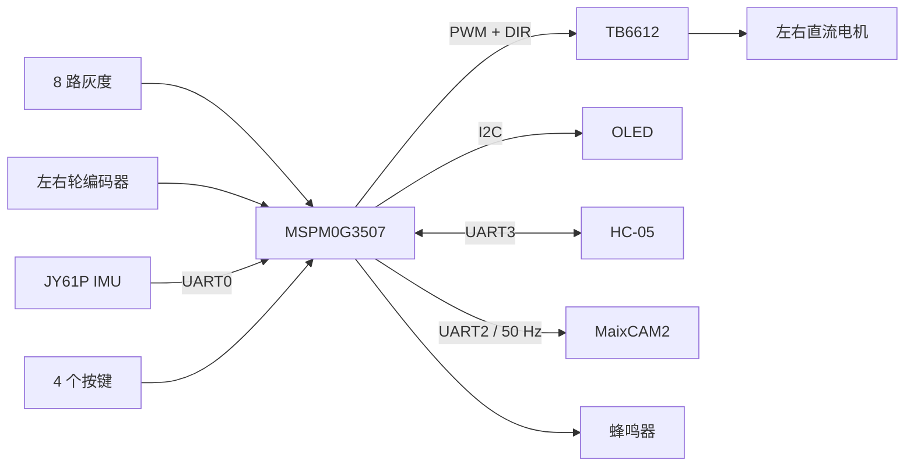
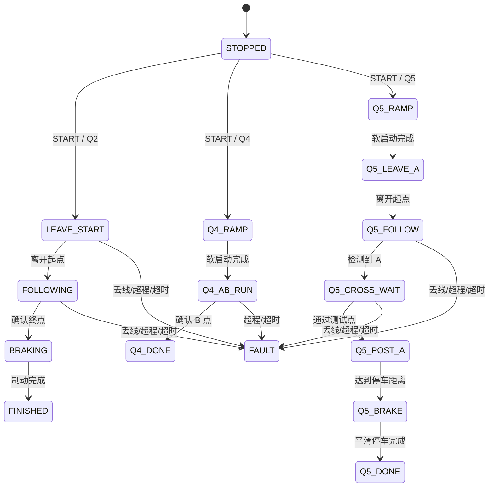

# 车载平衡滚珠运动控制系统

基于 TI MSPM0G3507 的电赛 H 题小车电控工程。系统以 5 ms 周期完成灰度采样、编码器里程/速度估计、JY61P 姿态更新、差速巡线和多模式状态机控制，并通过 UART 与 MaixCAM2 滚珠视觉控制端交换前馈信息。

本目录是小车 MCU 侧 CCS 工程，覆盖底盘感知、运动控制、终点判定、故障保护、在线调参和人机交互。摄像头视觉及闭环步进电机控制程序不属于本目录的主固件。

## 项目结果

以下为联合调试阶段的代表性结果。数据受场地、供电、轮胎状态和参数配置影响。

| 指标 | 结果 |
| --- | --- |
| 底盘控制周期 | 5 ms（200 Hz） |
| 完整绕圈测试 | 4 次测试平均约 18.2 s |
| A 点停车精度 | 满足不超过 2 cm 的赛题要求 |
| 滚珠目标位置切换 | 系统联合测试约 3.9 s |
| MaixCAM2 前馈发送 | 20 ms（50 Hz），单字节非阻塞发送 |
| 蓝牙在线调参 | 38,400 baud，支持控制、参数修改和遥测 |

## 系统架构



```text
灰度/编码器/IMU采样
        ↓
位置、里程、速度和航向估计
        ↓
PD 巡线 + 死区/限幅/斜率限制
        ↓
Q2/Q4/Q5 状态机与安全判断
        ↓
左右轮差速 PWM → TB6612 → 电机
```

## 控制策略

### 灰度巡线

8 路数字灰度数据以一个 `uint8_t` 表示，置位表示对应通道检测到黑线。`GraySensor_GetPosition()` 对有效通道进行加权质心计算，巡线控制器据此得到相对中心位置误差。

转向输出采用 PD 结构，并经过误差死区、输出限幅、相邻周期斜率限制、左右轮差速叠加和 PWM 上下限保护。短时丢线时保持上一周期转向，持续丢线超过设定时间后故障停车。

### 终点识别

A 点终点判定组合使用：

- 编码器里程窗口；
- 预计圈时窗口；
- 黑线通道数量阈值；
- 连续多个 5 ms 周期确认；
- 超程、丢线和总运行时间保护。

进入预计终点区域后按设定比例降速。确认终点后先主动制动，再停止 PWM 输出。

### Q4：A 到 B

- 启动时锁定 JY61P 航向；
- 以二次缓出曲线逐步提高 PWM；
- 前段叠加灰度位置修正和航向修正；
- 到达设定距离后关闭灰度环，仅保持航向；
- 通过距离条件和连续全白检测确认 B 点；
- 超时或超程时进入故障状态。

### Q5：整圈通过 A 点

- 采用 `3x² - 2x³` S 曲线软启动；
- 离开起点后才使能 A 点检测；
- 通过时间、里程和黑线连续确认识别再次到达 A 点；
- 记录圈时后继续行驶指定距离；
- 最后按设定时间平滑减速并停车。

MCU 按 50 Hz 向 MaixCAM2 发送单字节前馈：最高位表示直道/弯道，低 7 位表示经过零偏校正和低通滤波的纵向加速度。加速度数据超过 200 ms 未更新时立即按零值发送。

## 状态机



任何运行状态都可以通过按键或蓝牙 `STOP` 请求停止。

## 5 ms 实时控制周期

`TIMG6` 每 5 ms 触发一次控制中断。当前固件采用裸机前后台架构，不使用 RTOS。

| 周期/触发源 | 执行内容 | 运行位置 |
| --- | --- | --- |
| 5 ms / TIMG6 | 系统节拍、按键、编码器速度、灰度、航向、状态机和电机输出 | 定时器 ISR |
| 20 ms / 分频 | MaixCAM2 加速度/路段前馈 | 定时器 ISR，非阻塞发送 |
| UART0 RX | JY61P `0x51` 加速度帧和 `0x53` 角度帧解析 | UART ISR |
| GPIO 边沿 | 左右轮编码器计数 | GPIO ISR |
| UART3 RX | HC-05 命令接收与成帧 | UART ISR + 主循环 |
| 50 ms | 更新 IMU 在线状态 | 主循环 |
| 100 ms | OLED 刷新 | 主循环 |
| 可配置 | 蓝牙遥测 | 主循环 |

> 当前实现将完整控制计算放在 5 ms ISR 中以保持比赛版本的确定性。ISR 最坏执行时间、共享数据一致性和 PC 自动化测试仍是后续工程化重点。

## 硬件与引脚

引脚以 [`empty_mspm0g3507.syscfg`](./empty_mspm0g3507.syscfg) 为配置真源，不要直接编辑 `Debug/ti_msp_dl_config.c/.h`。

| 功能 | 外设/引脚 | 说明 |
| --- | --- | --- |
| 左右轮 PWM | TIMG0 CCP0 `PA12`、CCP1 `PA13` | 计数周期 4000 |
| 左电机方向 | `PB19`、`PB17` | TB6612 IN1/IN2 |
| 右电机方向 | `PA16`、`PB24` | TB6612 IN1/IN2 |
| 左编码器 | `PA27`、`PA26` | GPIO 边沿中断 |
| 右编码器 | `PA14`、`PA25` | GPIO 边沿中断 |
| 8 路灰度 | CLK `PB6`、DAT `PB7` | 串行移位读取 |
| JY61P | UART0 `PA0/PA1`，9600 baud | 姿态和加速度 |
| HC-05 | UART3 `PB2/PB3`，38,400 baud | 调参和遥测 |
| MaixCAM2 | UART2 TX `PA23`，115,200 baud | 50 Hz 前馈 |
| 红外/模拟量 | ADC1 `PA15` | 辅助检测 |
| 蜂鸣器 | `PA7` | 非阻塞鸣叫 |
| 按键 K1-K4 | `PB1/PB10/PB11/PB14` | 上一题、下一题、启动、停止 |
| OLED | I2C，地址 `0x3C` | 128×64 显示 |

## 软件模块

| 文件 | 职责 |
| --- | --- |
| [`main.c`](./main.c) | 初始化、5 ms ISR、前馈、主循环和 OLED |
| [`route_fsm.c`](./route_fsm.c) | 巡线、终点判断、Q2/Q4/Q5 状态机和保护 |
| [`motor.c`](./motor.c) | TB6612、编码器、里程和 PID 工具 |
| [`gray_sensor.c`](./gray_sensor.c) | 灰度串行读取和加权位置 |
| [`jy61p.c`](./jy61p.c) | JY61P UART 解析、姿态和加速度 |
| [`bluetooth.c`](./bluetooth.c) | 命令解析、参数修改、运行控制和遥测 |
| [`key.c`](./key.c) | 5 ms 按键消抖 |
| [`buzzer.c`](./buzzer.c) | 非阻塞蜂鸣提示 |
| [`oled.c`](./oled.c) | OLED 显存和 I2C 刷新 |
| [`soft_i2c.c`](./soft_i2c.c) | 软件 I2C 和总线恢复 |
| [`empty_mspm0g3507.syscfg`](./empty_mspm0g3507.syscfg) | 外设、时钟和引脚配置 |

## 操作方式

### 板载按键

| 按键 | 功能 |
| --- | --- |
| K1 | 待机状态选择上一题 |
| K2 | 待机状态选择下一题 |
| K3 | 按当前题目模式启动 |
| K4 | 任意状态请求停止 |

OLED 显示灰度位图、黑线通道数、位置误差、转向量、运行时间、题号、左右轮速度、航向角以及完成/复位原因。

### 蓝牙调参

HC-05 使用 `38400 8N1`。命令为 ASCII 文本，以 `\r` 或 `\n` 结尾；接收空闲超过 200 ms 也会自动成帧。

```text
HELP                 显示命令列表
SHOW                 显示当前状态和参数
MODE 2               设置运行模式
START / STOP         启动 / 停止
ZERO                 编码器里程清零
TEL 100 / TEL 0      开启 / 关闭遥测

KP 1.00              巡线比例系数
KD 0.10              巡线微分系数
BASE 1200            基础 PWM
LIM 1500             修正限幅
TRIM 0               左右轮补偿
DZ 3                 误差死区
SLEW 75              单周期转向变化上限

FMIN 520 / FMAX 620  终点距离窗口，cm
BTH 4                最少黑色通道数
FCNT 2               连续确认周期数
BRAKE 100            制动时间，ms
LOST 500             丢线故障时间，ms

LAP 17.5             目标圈时，s
TW 1.0               终点时间窗口，s
SLOWR 0.70           终点前速度比例
SLOWA 1.5            提前降速时间，s
FBA 1.2              后备停车延时，s
TOUT 20.0            总安全超时，s
```

Q4/Q5 还支持 `Q4PWM`、`Q4RAMP`、`Q4ARM`、`Q4B`、`Q4HKP`、`Q4HLIM`、`Q5PWM`、`Q5RAMP`、`Q5OFFSET`、`Q5POST`、`Q5STOP`、`Q5TOUT`、`Q5TMIN` 和 `Q5TMAX`。

## 构建与烧录

- MCU：TI MSPM0G3507，LQFP-64；
- IDE：Code Composer Studio Theia；
- 编译器：TI Arm Clang；
- MSPM0 SDK：`2.10.00.04`；
- SysConfig：`1.28.0`；
- 目标配置：`targetConfigs/MSPM0G3507.ccxml`，XDS110。

1. 安装匹配版本的 MSPM0 SDK。
2. 在 CCS 中导入当前 `26Hcar-BNO055` 工程。
3. 打开 `empty_mspm0g3507.syscfg`，确认设备、封装和 SDK 可解析。
4. 构建 `Debug` 配置。
5. 核对实际调试器与目标配置一致后再烧录。

工程通过 SysConfig 生成 `ti_msp_dl_config.c/.h`。修改引脚、时钟或外设时应修改 `.syscfg` 并重新生成。

## 调试与故障定位

1. 观察 OLED 是否依次显示 `BOOT`、`JY61P INIT` 和 `JY61P OK`。
2. 若停在 `JY61P FAIL`，检查供电、共地和 UART TX/RX 交叉连接。
3. 蓝牙发送 `SHOW`，确认模式、状态、里程和参数。
4. 使用 `TEL 100` 观察灰度、误差、速度和航向。
5. 抬起车轮转动，确认前进时左右编码器读数均为正。
6. 使用 `MODE 6` 和 `ZERO` 手推标定里程。
7. 首次运行先降低 PWM，验证方向和 STOP 后再提速。

电机调试时应架空车轮或留出安全空间。源码构建成功不等于实车行为已验证。

## 项目职责与实现范围

- 基于 MSPM0G3507 和 DriverLib 完成底盘外设集成；
- 建立 5 ms 裸机实时控制框架；
- 实现灰度加权位置 PD、差速驱动和编码器里程/速度估计；
- 设计多赛题状态机、终点复合判定及丢线/超程/超时保护；
- 实现 JY61P 中断接收、姿态/加速度解析和 MaixCAM2 前馈链路；
- 实现按键、OLED、蓝牙在线调参和遥测；
- 参与整车、视觉端和滚珠执行机构的系统联调。

## 当前限制与后续方向

- `route_fsm.c` 仍混合控制算法、参数、状态迁移和硬件输出；
- 5 ms ISR 尚未记录最坏执行时间；
- 纯算法逻辑尚未与 DriverLib 完全解耦；
- 当前没有 PC 单元测试和持续集成；
- 共享变量和故障注入仍需系统化验证。

后续计划先建立回归测试，再抽离纯 C 算法，最后重构状态机，避免影响已经通过实车验证的比赛行为。